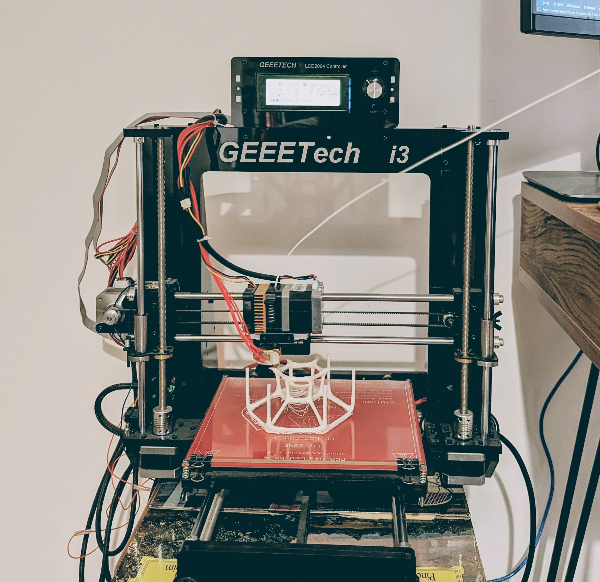

GEEETECH Black Acrylic I3 Pro B
===============================

<div style="text-align:center"></div>

# Setup
Driver

```
# This is the driver for the FTDI chip used on the circuit board on the printer.
Software/FTDIUSBSerialDriver_v2_4_2.dmg
```

3D Printing Application

```
# Basic 3D printing software that works with the printer out of the box
Software/Repetier-Host-Mac_1_1_0.dmg
```

# Troubleshooting

If the Repetier software says "firmware not found", 
it could be because the USB cable and/or the dongle is not good enough.

Use an official Apple USB-C to USB converter.
